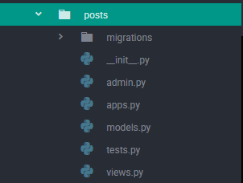
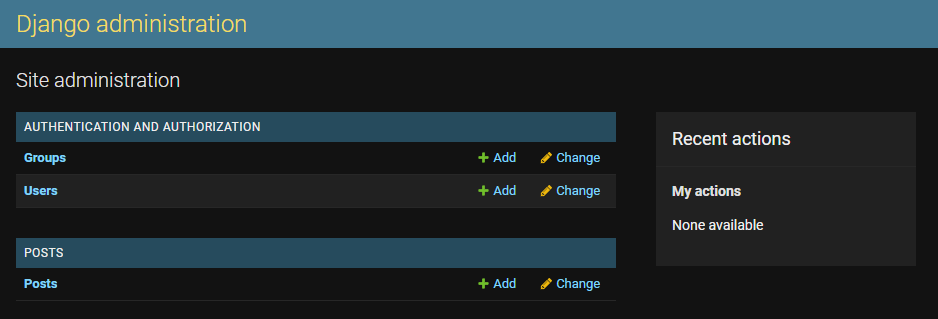
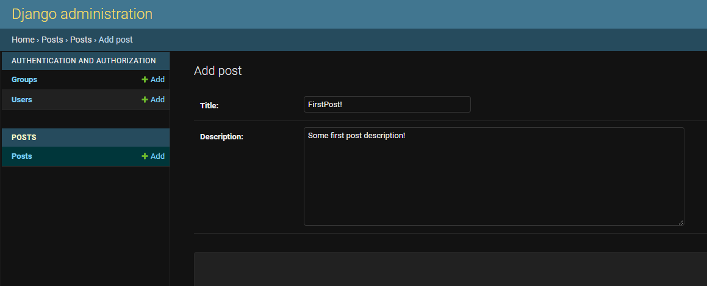

# Apps
Podstawy tworzenia aplikacji krok po kroku

```
python manage.py startapp posts
```

Stworzy nam się folder o nazwie aplikacji, zawiera pliki:



Dodajemy nazwę aplikacji do listy *INSTALLED_APPS* w pliku *settings.py*

## Tworzenie model

W pliku *models.py* tworzymy model ktory jest obiektem i odwoluje sie do bazy danych.
Modele zawsze dziedziczą od *models.Model*, zajmuje się tym Django
Przykładowy model:
```
from django.db import models

# Create your models here

class Post(models.Model):
    title = models.CharField(max_length=50)
    description = models.TextField()

    def __str__(self):
        return self.title
```
Za każdym razem gdy ingerujemy w models dokonujemy migracji poprzez:
```
python manage.py makemigrations
python manage.py migrate
```

Importujemy model i rejestrujemy w pliku *admin.py*

```
from .models import Post
admin.site.register(Post)
```

  


modell2 img

## Views
doc: https://docs.djangoproject.com/en/4.0/topics/http/views/  
W pliku *views.py* piszemy funkcje pythonowe które przyjmują request i zwracają response w postaci np. pliku html:

```
from django.shortcuts import render
from .models import Post

# Create your views here.

def post_list_view(request):
    post_objects = Post.objects.all()
    context = {
        'post_objects': post_objects
    }
    return render(request, "posts/index.html", context)
```

Teraz musimy dodać path do pliku *urls.py*
importujemy funkcję z *views.py*
```
from posts.views import post_list_view
```
dodajemy path:
```
urlpatterns = [
    path('admin/', admin.site.urls),
    path('posts/', post_list_view)
]
```
Oznacza to że jeśli wejdziemy na stronę http://127.0.0.1:8000/posts wywołana zostanie funkcja
post_list_view która wyświetli index.html

## Templates
doc: https://docs.djangoproject.com/en/4.0/topics/templates/  

W naszej aplikacji tworzymy folder templates, a w nim index.html
```
<!DOCTYPE html>
<html lang="en" dir="ltr">
    <head>
        <meta charset="utf-8">
        <title></title>
    </head>
    <body>
        <h1>List of posts:</h1>
        
            <p>{{ i }} </p>
        
    </body>
</html>
```
Między  możemy pisać w pythonie np ify czy pętle  
Między {{}} możemy umieszczać zmienne  
W tym przypadku tworzymy pętle która wyświetli stworzone posty:


