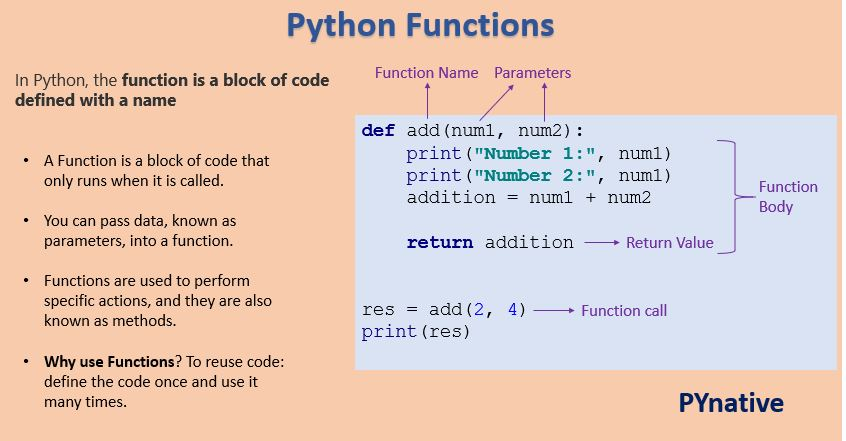

# Built-in Functions
Python gwarantuje nam wiele wbudowanych funkcji, ich spis znajdziemy tutaj:
https://docs.python.org/3/library/functions.html


# Functions
Source: https://www.w3schools.com/python/python_functions.asp
PYNative
## Tworzenie funkcji
W pythonie funckje tworzymy poprzez *def*

```
def my_function():
  print("Hello from a function")
```

## Wywoływanie funkcji
Aby wywołać funkcje należy napisać jej nazwe

```
def my_function():
  print("Hello from a function")

my_function()
```

## Argumenty
Wewnątrz nawiasów możemy przekazać argumenty/parametry funkcji.

```
def my_function(fname):
  print(fname + " Refsnes")

my_function("Emil")
my_function("Tobias")
my_function("Linus")

def my_function(fname, lname):
  print(fname + " " + lname)

my_function("Emil", "Refsnes")
```

Jeśli nie wiemy ile parametrów ma przyjąc funkcja, należy użyc * lub **
W przypadku * funkcja przyjmie krotke (tuple) argumentów, w przypadku ** przyjmie slownik (dictionary)

```
def my_function(*kids):
  print("The youngest child is " + kids[2])

my_function("Emil", "Tobias", "Linus")

def my_function(**kid):
  print("His last name is " + kid["lname"])

my_function(fname = "Tobias", lname = "Refsnes")
```
## Zwracanie wartości przez funkcje
Aby funkcja zwróciła nam jakąś wartość używamy return:

```
def add(a, b):
    return a + b

add(4, 5) # function will return 9

def my_function(x):
  return 5 * x

print(my_function(3)) #15
print(my_function(5)) #25
print(my_function(9)) #45
```


