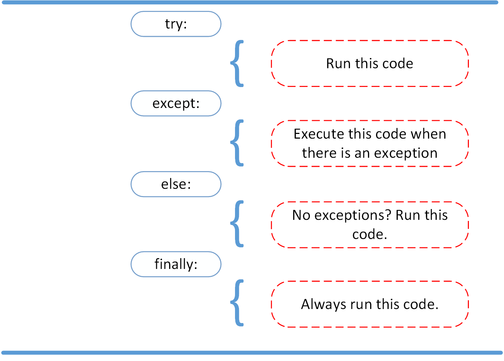

# Type Casting
source: https://www.w3schools.com/python/python_casting.asp

## Ustalanie typów danych
Poprzez casting możemy ustalić dany typ danych:
```
**int()**    - daje liczbę całkowitą
**float()**  - daje liczbę zmiennoprzecinkową
**str()**    - daje string
```

Integers:
```
x = int(1)   # x will be 1
y = int(2.8) # y will be 2
z = int("3") # z will be 3
```

Floats:
```
x = float(1)     # x will be 1.0
y = float(2.8)   # y will be 2.8
z = float("3")   # z will be 3.0
w = float("4.2") # w will be 4.2
```

Strings:
```
x = str("s1") # x will be 's1'
y = str(2)    # y will be '2'
z = str(3.0)  # z will be '3.0'
```

# Exceptions
source: https://www.w3schools.com/python/python_try_except.asp
udemy section 21

## Try, expect, else, finally, raise


