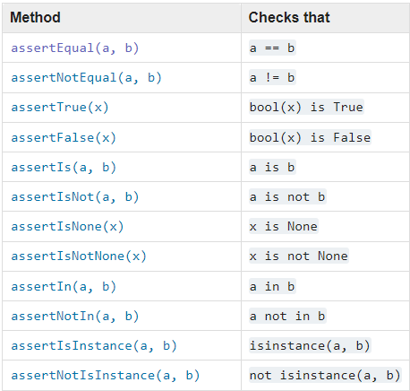
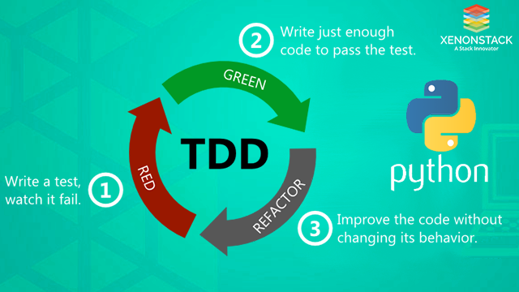

# Testing
Sources: https://docs.python.org/3/library/unittest.html  
https://realpython.com/python-testing/#testing-your-code  
xenonstack  
udemy course section 29  


# Unit Test
Python posiada built-in module - unittest
Możemy pisać unit testy które są klasami i muszą dziedziczyć z *unittest.TestCase*
```
import unittest
from robot import Robot


class RobotTests(unittest.TestCase):
    def setUp(self):
        self.mega_man = Robot("Mega Man", battery=50)
```

Unittest zawsze kończymy:
```
if __name__ == "__main__":
    unittest.main()
```

Aby zobaczyć test szczegółowo wpisujemy:
```
py <filename.py> -v
```

## Assert
Ważnym elementem testowania są assert. Pozwalają nam sprawdzać dane warunki.
Najpopuralniejsze z nich:



Pełną listę znajdziemy np. tu: https://docs.python.org/3/library/unittest.html

# TDD
soon  

